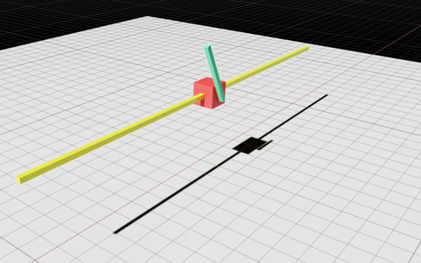
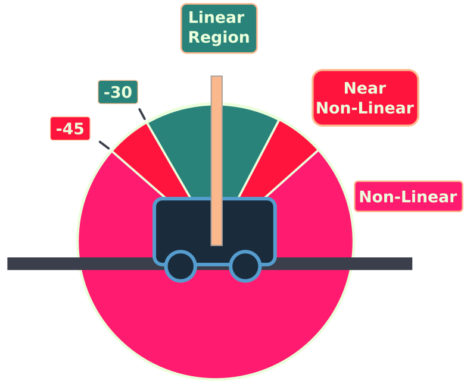

# Cart-Pole Stabilisation in NVIDIA Isaac Sim

A comparative study of classical and learned control strategies for cart-pole stabilisation, implemented and benchmarked in **NVIDIA Isaac Sim** with **Isaac Lab**.

# Project demo Video availble in [`Video`](Video/Working_demo.mkv) or on ['Youtube'](https://youtu.be/hAa3eeW9kiE?si=1yooxw9HBWlTF5fw)

Three controllers are implemented: **PID** (three architectures), **LQR**, and **PPO** (via curriculum learning). The project covers the full pipeline — asset construction in USD, physics parameterisation, controller design, and a structured evaluation framework.

> 🚧 **Work in progress** — curriculum training and robustness evaluation are ongoing. Results and extensions will be added as they are completed.

---

## Hardware & Setup

| | |
|---|---|
| **GPU** | NVIDIA RTX 3090 |
| **CPU** | AMD Ryzen 9 |
| **OS** | Ubuntu 22.04 |
| **Simulator** | NVIDIA Isaac Sim 5.1 + Isaac Lab |
| **RL Framework** | skrl (PPO, 4096 parallel envs) |
| **Language** | Python |

---

## Goals

This project is part of a broader self-directed programme in robotics and control, with two main motivations:

- **Skill building** — hands-on experience with GPU-accelerated simulation, classical control theory (PID, LQR), and reinforcement learning in a physically realistic environment.
- **Community sharing** — documenting the full development process openly, including design decisions, pitfalls, and results, so others getting started with Isaac Sim or control RL have a reference to learn from.

---

## What's Done

- [x] Cart-pole asset built from scratch in Isaac Sim (USD)
- [x] Physics validated against analytical linearised dynamics (<1% error)
- [x] PID (single-loop, dual-loop, cascade) implemented and compared
- [x] LQR designed and benchmarked
- [x] PPO trained — curriculum Stages 1 & 2 (up to ±30° initialisation)
- [x] Structured evaluation framework with CSV logging

## In Progress / Planned

- [ ] PPO curriculum Stages 3–5 (up to ±150°, full swing-up)
- [ ] Robustness evaluation (impulse disturbances, sensor noise, Kalman filter)
- [ ] Physical parameter sweeps (damping, mass ratio)
- [ ] SAC vs PPO comparison
- [ ] Cross-simulator benchmarking (MuJoCo, Gazebo)
- [ ] Double-pendulum extension

---

## Report

A technical report covering the methodology and completed results is available in [`Report`](cartpole_report_current.pdf).

---

*K Lab — May 2026*
